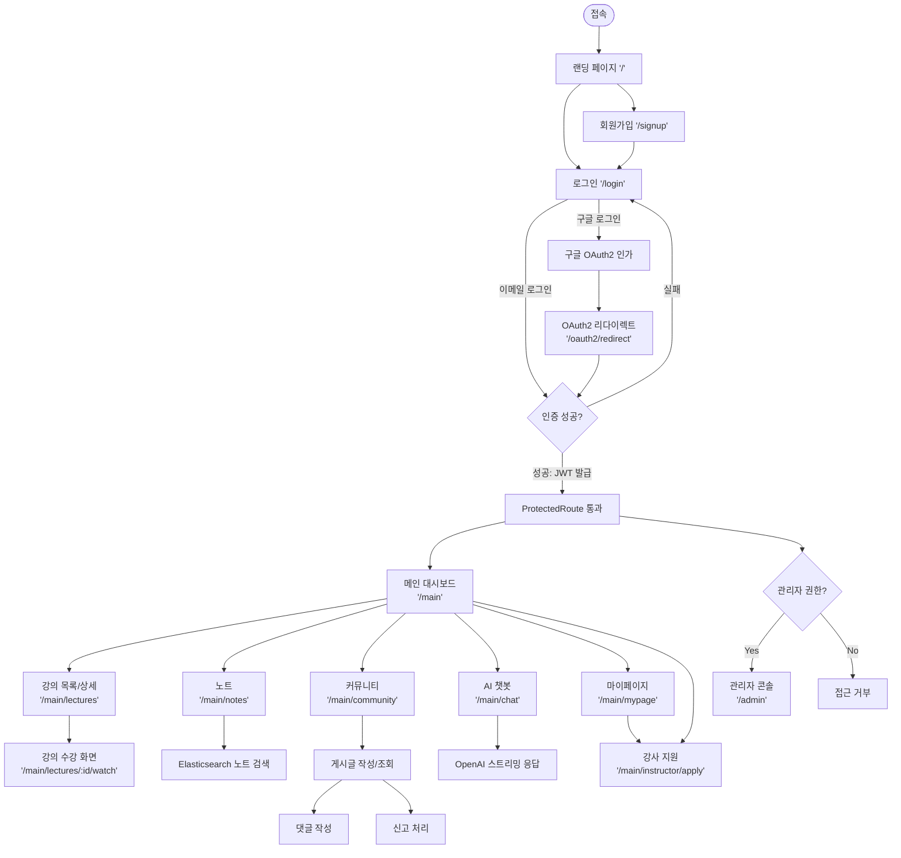
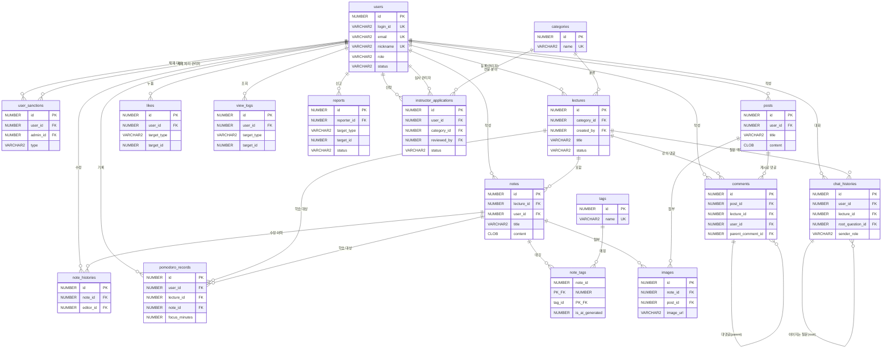

# NYO (Note Your Own) 
온라인 강의를 들으며 남긴 학습 노트를 강의 단위로 모아 공유하는 학습 플랫폼입니다.
노트 · 뽀모도로 · 강의 · 커뮤니티 · AI 챗봇 기능을 제공하고 있으며,
백엔드(Spring Boot)와 프론트엔드(React)로 구성되어 있습니다.
- GitHub: https://github.com/sso0x0/NYO_Note-Your-Own

## 주요 기능

### 🔐 회원 / 인증
- 이메일 회원가입·로그인 후 **JWT 액세스 토큰** 발급 (`jwt.access-token-validity-ms` 1시간)
- **구글 OAuth2** 소셜 로그인 (`/oauth2/redirect`)
- **Solapi** 연동 SMS 인증번호 발송 (휴대폰 본인 확인)

### 📝 노트
- 개인 노트 작성·수정·삭제
- 노트 본문을 **Elasticsearch(Nori 한글 형태소 분석기)** 로 색인해 빠른 키워드 검색 지원
- 노트 내용을 분석해 관련 **태그를 AI가 자동으로 추천**(AI Tagging)

### ⏱️ 뽀모도로
- 집중 타이머 기록 저장
- 사용자별 학습 시간 통계 제공

### 🎓 강의
- 강의 등록·수강 신청
- **스케줄러**를 이용한 강의 상태 자동 갱신(모집 마감 등)
- 강의 검색을 위한 Elasticsearch 색인
- **강사(instructor)** 전용 강의 등록 가능

### 💬 커뮤니티
- 게시글·댓글 CRUD, 카테고리/태그 분류
- 게시글 Elasticsearch 색인 검색
- **금칙어 필터(`ProhibitedWordFilter`)** 로 부적절한 게시글/댓글 확인 가능
- 신고(report) 기능으로 사용자 간 콘텐츠 신고 처리

### 🤖 AI 챗봇
- **OpenAI(gpt-4o)** 기반 대화형 챗봇, 답변을 **스트리밍**으로 실시간 출력
- 스트리밍 중 **중단 버튼**으로 응답 생성 취소 가능
- 대화 이력(`ChatHistory`) 저장으로 이전 대화 이어보기

### 🛠️ 관리자
- 회원·게시글·강의 등 전체 콘텐츠를 관리하는 관리자 전용 페이지
- 신고 처리, 콘텐츠 모니터링

### 📦 파일 업로드
- **GCP Cloud Storage** 연동 이미지 업로드 (프로필, 게시글 첨부 등)

## 기술 스택

| 구분 | 기술 |
|---|---|
| Backend | Java 17, Spring Boot 3.5.16, Spring Data JPA, Spring Security, JWT, OAuth2 Client |
| DB | Oracle Database (XE) |
| 검색 | Elasticsearch 8.17.4 (Nori 한글 형태소 분석기) |
| AI | OpenAI API (gpt-4o) |
| 파일 저장소 | Google Cloud Storage |
| SMS | Solapi |
| Frontend | React 19, React Router 7, Vite 8 |
| 빌드 도구 | Gradle (backend), npm (frontend) |
| 인프라 | Docker (Elasticsearch/Kibana) |

## 프로젝트 구조

```
nyo/
├── docker-compose.yml   # Elasticsearch + Kibana
├── Dockerfile           # Elasticsearch + Nori 플러그인
├── backend/             # Spring Boot 서버
│   └── src/main/java/com/nyo/
│       ├── domain/      # user, post, comment, category, tag, lecture, instructor,
│       │                # note, pomodoro, chat, ai, report, admin, common
│       └── global/      # config, security, jwt, oauth2, exception, moderation,
│                        # sms, storage, response, enums
└── frontend/            # React (Vite) 클라이언트
    └── src/
        ├── api/
        ├── components/
        ├── context/
        ├── router/
        └── features/    # auth, main, landing, note, pomodoro, lecture, community,
                          # chat, mypage, instructor, admin, report
```

## 흐름도

### 프로젝트 전체 플로우차트



## ERD

총 17개 테이블로 구성되어 있으며, `users`를 중심으로 노트/강의/커뮤니티/신고/챗봇/뽀모도로 도메인이 연결됩니다.
`likes`, `view_logs`, `images`는 대상 종류(`target_type`)로 노트·게시글·강의를 함께 참조하는 폴리모픽 구조입니다.



> `likes.target_type`, `view_logs.target_type`, `images`(note_id/post_id 중 하나), `comments`(post_id/lecture_id 중 하나)는
> DB 레벨 FK가 아닌 폴리모픽/조건부 참조라 위 다이어그램에서는 대표 관계만 표시했습니다.

## 사전 준비물

- **JDK 17** (Java 17 이상)
- **Oracle Database (XE)** — 로컬에 설치되어 있어야 합니다 (`localhost:1521/XE`)
- **Docker** — Elasticsearch/Kibana 실행용
- **Node.js** (LTS 버전 권장, npm 포함)
- **Git**
- IDE: IntelliJ (backend) / VSCode (frontend) 권장

## 1. 저장소 클론

```bash
git clone https://github.com/sso0x0/NYO_Note-Your-Own.git
cd NYO_Note-Your-Own
```

## 2. 백엔드(Spring Boot) 세팅

### 2-1. 환경변수(.env) 설정

`backend` 폴더 안에 `.env` 파일을 새로 만들고 아래 값을 채워주세요.
```env
# Oracle DB
DB_USERNAME=본인_DB_계정
DB_PASSWORD=본인_DB_비밀번호

# JWT
JWT_SECRET=임의의_긴_시크릿_문자열

# 구글 OAuth2 소셜 로그인
GOOGLE_CLIENT_ID=구글_클라이언트_ID
GOOGLE_CLIENT_SECRET=구글_클라이언트_시크릿

# CORS (프론트 주소, ngrok으로 외부 접속 테스트 시 ngrok 주소도 추가)
CORS_ALLOWED_ORIGINS=http://localhost:5173

# 구글 OAuth2 리다이렉트 (ngrok으로 테스트할 때만 필요, 로컬만 쓸 땐 생략 가능 - 기본값이 {baseUrl}/login/oauth2/code/google)
# GOOGLE_REDIRECT_URI=https://본인_ngrok_주소/login/oauth2/code/google
# OAUTH2_FRONTEND_REDIRECT_URI=https://본인_ngrok_주소/oauth2/redirect

# Elasticsearch
ELASTICSEARCH_URI=http://localhost:9200

# OpenAI (AI 챗봇/태깅)
OPENAI_API_KEY=본인_OPENAI_API_KEY

# Solapi (SMS 인증)
SOLAPI_API_KEY=솔라피_API_KEY
SOLAPI_API_SECRET=솔라피_API_SECRET
SOLAPI_SENDER_PHONE=발신용_전화번호
```

> GCP Cloud Storage(이미지 업로드)를 쓰려면 서비스 계정 키 파일을 받아 `GOOGLE_APPLICATION_CREDENTIALS` 환경변수로 경로를 지정해야 합니다. (`gcp.storage.bucket`은 `nyo_images`로 고정되어 있습니다.)

### 2-2. Oracle DB 확인

- Oracle XE가 로컬에서 `1521` 포트로 떠 있어야 합니다.
- `ddl-auto: none`이라 **테이블을 자동 생성하지 않습니다.** 팀에서 공유하는 DDL/덤프(`nyo.sql`)를 미리 실행해서 스키마를 맞춰주세요.

### 2-3. Elasticsearch 실행 (Docker)

노트/강의/게시글 검색 기능에 필요합니다.

```bash
docker-compose up -d
```

- Elasticsearch: `http://localhost:9200`
- Kibana: `http://localhost:5601`

### 2-4. 서버 실행

IntelliJ에서 `backend` 폴더를 Gradle 프로젝트로 열거나, 터미널에서 직접 실행합니다.

```bash
cd backend
./gradlew bootRun        # Mac/Linux
gradlew.bat bootRun       # Windows
```

정상적으로 뜨면 `http://localhost:8080`에서 서버가 실행됩니다.
API 문서(Swagger UI)는 `http://localhost:8080/docs`에서 확인할 수 있습니다.

## 3. 프론트엔드(React) 세팅

```bash
cd frontend
npm install
npm run dev
```

실행 후 터미널에 뜨는 주소(기본값 `http://localhost:5173`)로 접속하면 됩니다.

주요 npm 스크립트:

| 명령어 | 설명 |
|---|---|
| `npm run dev` | 개발 서버 실행 |
| `npm run build` | 프로덕션 빌드 |
| `npm run lint` | ESLint 검사 |
| `npm run preview` | 빌드 결과 미리보기 |

## 4. ngrok으로 구글 로그인(OAuth2) 테스트하기

구글 OAuth2는 로컬(`localhost`) 접속만으로는 다른 기기에서 확인하거나 배포 환경과 동일하게 테스트하기 어렵습니다.
그래서 `ngrok`으로 프론트(`5173`)를 외부에 노출시켜 테스트합니다. 백엔드(`8080`)는 따로 터널을 열 필요 없이,
[vite.config.js](frontend/vite.config.js)의 프록시 설정(`/api`, `/oauth2/authorization`, `/login/oauth2` → `localhost:8080`)이 알아서 넘겨줍니다.

**개발할 때마다 아래 순서로 3개를 모두 띄워야 합니다.**

1. 백엔드 실행 (`8080`)
2. 프론트 dev 서버 실행 (`5173`)
3. ngrok 터널 실행

```powershell
& "$env:LOCALAPPDATA\ngrok\ngrok.exe" http --domain=본인_ngrok_고정도메인 5173
```

- `--domain` 플래그 없이 `ngrok http 5173`만 실행하면 무료 플랜은 **재시작할 때마다 주소가 랜덤으로 바뀝니다.** 고정 도메인(ngrok 대시보드에서 무료로 1개 발급 가능)을 예약해서 `--domain`으로 지정해야 매번 같은 주소를 씁니다.
- ngrok 주소가 바뀌면 아래 세 곳을 전부 새 주소로 맞춰야 합니다.
  - Google Cloud Console OAuth 클라이언트의 **승인된 리디렉션 URI**
  - `.env`의 `GOOGLE_REDIRECT_URI`, `OAUTH2_FRONTEND_REDIRECT_URI`
  - `.env`의 `CORS_ALLOWED_ORIGINS`

## 5. 자주 발생하는 문제

- **`ORA-` 관련 DB 연결 에러**: Oracle XE 서비스가 켜져 있는지, `.env`의 계정 정보가 맞는지 확인하세요.
- **`.env` 인식이 안 될 때**: `.env` 파일 위치가 `backend/.env`가 맞는지 확인해주세요. (`me.paulschwarz:spring-dotenv` 라이브러리가 이 파일을 읽어옵니다.)
- **검색이 안 될 때**: `docker-compose up -d`로 Elasticsearch가 떠 있는지, `ELASTICSEARCH_URI`가 맞는지 확인하세요.
- **AI 챗봇 응답이 안 올 때**: `OPENAI_API_KEY`가 설정됐는지 확인하세요.
- **포트 충돌 (8080 / 5173 / 9200 / 5601)**: 다른 프로세스가 해당 포트를 쓰고 있지 않은지 확인하세요.
- **구글 로그인 콜백이 `404`(`ERR_NGROK_3200`, "endpoint is offline")**: ngrok 터널이 꺼져있거나 로컬-클라우드 연결이 끊긴 상태입니다. ngrok을 껐다가(또는 좀비 프로세스가 있으면 종료 후) 다시 실행하세요.
- **ngrok 실행 시 `ERR_NGROK_334`("already online")**: 같은 고정 도메인을 물고 있는 ngrok 프로세스가 이미 실행 중입니다. 작업 관리자(또는 `Get-Process ngrok`)로 남아있는 프로세스를 찾아 종료한 뒤 다시 실행하세요.
- **구글 로그인 실패 사유가 `authorization_request_not_found`**: 로그인 시작(`/oauth2/authorization/google`)과 구글 콜백(`/login/oauth2/code/google`) 사이에 백엔드가 재시작됐거나, ngrok 주소가 도중에 바뀌어 세션이 끊긴 경우입니다. 브라우저 쿠키를 지우거나 시크릿 창에서 로그인 버튼부터 다시 시도하세요.
